# Peak Memory

**A cross-tissue meta-analysis of epigenetic injury/inflammation memory, its conserved AP-1 regulatory program, and its fate in aging and cancer.**

*Sampoorn Pandey*

> 📄 The full report is also available as [`docs/Methods_and_Results.md`](docs/Methods_and_Results.md) and as a typeset PDF/Word file. Jump to: [Summary](#summary) · [Results](#1-inflammatory-memory-from-immune-to-stem-cells) · [Repository layout](#repository-layout) · [Gene sets](#gene-sets) · [Reproduce](#reproducing-the-analysis) · [Data](#data-availability)

---

## Summary

Over the past decade, the memory of the immune system — classically the province of lymphocytes and, more recently, of innate "trained immunity" — has been shown to extend to non-immune, tissue-resident cells. Epidermal stem cells, hair-follicle stem cells, distal epidermal progenitors, pancreatic epithelium and, most recently (2026), human intestinal stem cells all retain a long-lived, chromatin-encoded record of a prior inflammatory or injurious encounter.

Although these systems differ in cell type and mode of injury, they share one framework: the encounter is stored as regions of chromatin that open during the perturbation, are absent in the naive state, and remain accessible long after the insult resolves. We asked whether there is a **common design principle** by which this memory is written, maintained and read.

**Headline findings.**

- The memory does **not** converge at the level of genomic coordinates (0 of ~10,600 regions shared by all four datasets) or target genes (explained by shared accessibility).
- It converges at the level of a **transcription-factor program dominated by AP-1** (with KLF, TEAD, CTCF), shared ~**10× more than chance** (z ≈ 25).
- Distilling the epidermal memory to its active, AP-1-bound enhancers (**PAME** — Primed AP-1 Memory Enhancers; 209 regions / 202 genes) yields a module wired into **cell adhesion, junctions and the cytoskeleton** — the machinery of wound repair and of EMT/invasion.
- These enhancers are **laid down by adulthood** and resist the genome-wide accessibility decline of aging.
- Their human orthologs define a **14-gene AP-1 signature prognostic in TCGA-HNSC** (HR ≈ 1.50, Cox *p* = 0.014), linking inflammatory memory to epigenetic field cancerization.

---

## 1. Inflammatory memory, from immune to stem cells

Immunological memory was long thought to be exclusive to the adaptive immune system, then extended to innate "trained immunity." The last several years localised this memory to ordinary **non-immune** cells: skin epithelial (epidermal) stem cells [Naik 2017; Larsen 2021], hair-follicle stem cells [Gonzales 2021], distal epidermal progenitors [Levra Levron 2023], pancreatic epithelium [Del Poggetto 2021], and human intestinal stem cells [2026]. Each stores its encounter as chromatin that is closed at baseline, **opens during** the perturbation, and **stays open** after resolution.

<p align="center">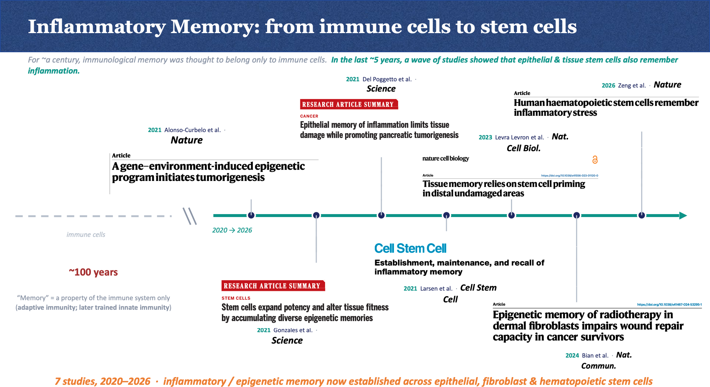</p>

## 2. Defining a memory peak

We define a *memory peak* purely from ATAC-seq coordinates: closed in **control**, reproducibly open across all **perturbation** replicates, still open in the post-resolution **memory** state, and removed if it overlaps any control peak. Four stringency variants (50/75 % × Single/Reciprocal) are computed; the primary set is `StrictMemory50_Single`. Final peaks are stored as BED files.

<p align="center">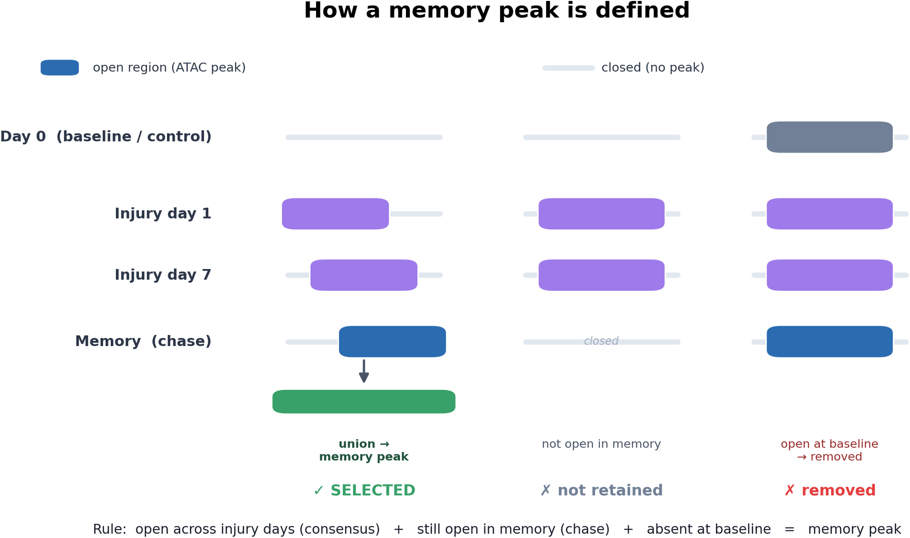</p>

The strict control filter is aggressive — it removes >90 % of candidates in skin (76,544 → 2,325) — leaving only high-confidence regions.

## 3. Memory peaks across four datasets

| Dataset | Cell type | Injury / source | Peaks |
|---|---|---|---:|
| **IMQ** | Epidermal stem cells | Imiquimod psoriasiform inflammation [Naik 2017; Larsen 2021] | 2,325 |
| **HFSC** | Hair-follicle stem cells | Dremel skin wound [Gonzales 2021] | 2,207 |
| **distil** | Distal epidermal progenitors | Wound priming in distal skin [Levra Levron 2023] | 3,096 |
| **pancreas** | Pancreatic epithelium | Transient pancreatitis [Del Poggetto 2021] | 3,261 |

<p align="center">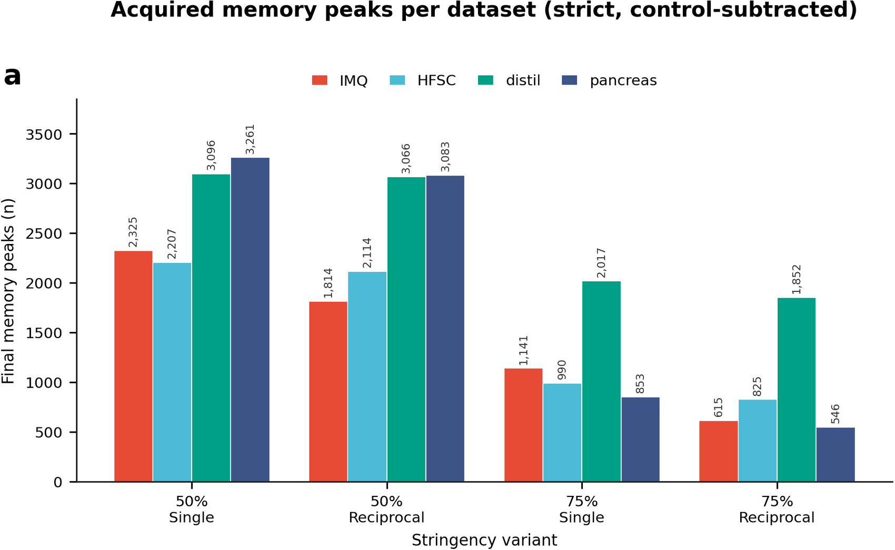</p>

## 4. Coordinates don't overlap; genes overlap only via shared accessibility

Merging all four StrictMemory sets gives a union of **10,604** regions, with **no region shared by all four** (best pairwise HFSC∩distil = 149). At the gene level, 64 genes are shared by all four — but against an **accessibility-matched** null this is *below* expectation (expected 84.5; 0.8×; *p* = 0.995). The apparent gene overlap is an artefact of shared accessible chromatin, not a shared memory-gene program.

<p align="center">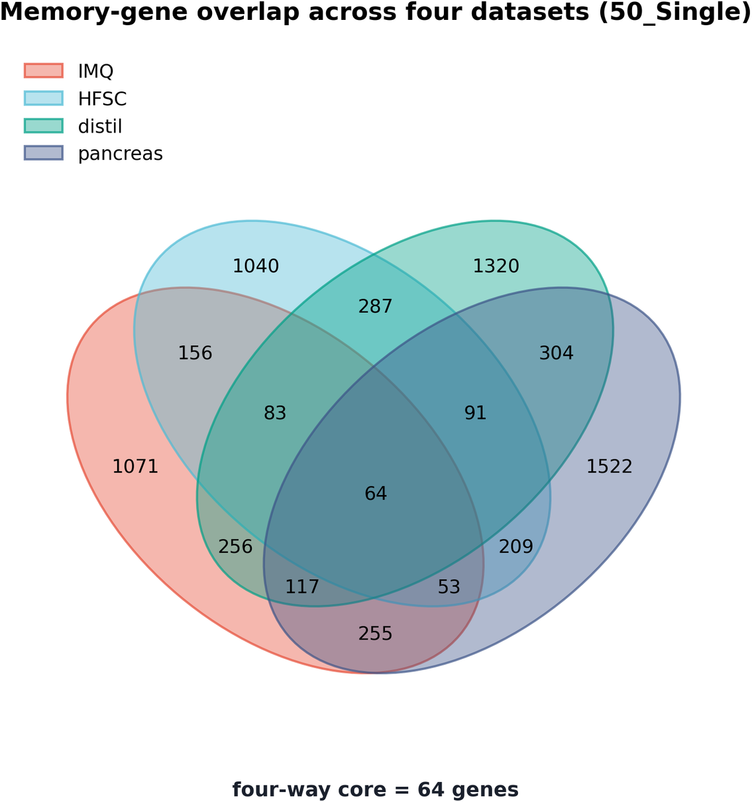</p>

## 5. Pathway enrichment

Memory genes recurrently return broad developmental, adhesion and stress-response programs, but coordinate/gene identity is not conserved — the specific convergence appears only at the regulatory level.

<p align="center">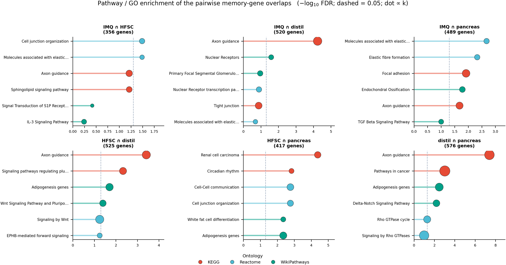</p>

## 6. The transcription-factor program is convergent (~10× over chance)

Each dataset yields 141–174 enriched TFs (*q* < 0.05); **68 are enriched in all four**. Against resampling from the tested-motif universe (20,000 permutations) this is **10.2× over chance** (z = 25.3, *p* < 5×10⁻⁵). The shared program is anchored by **AP-1** (FOS/JUN/FOSL/ATF3/BATF), with **KLF, TEAD, CTCF** and p53/p63/p73.

<p align="center">
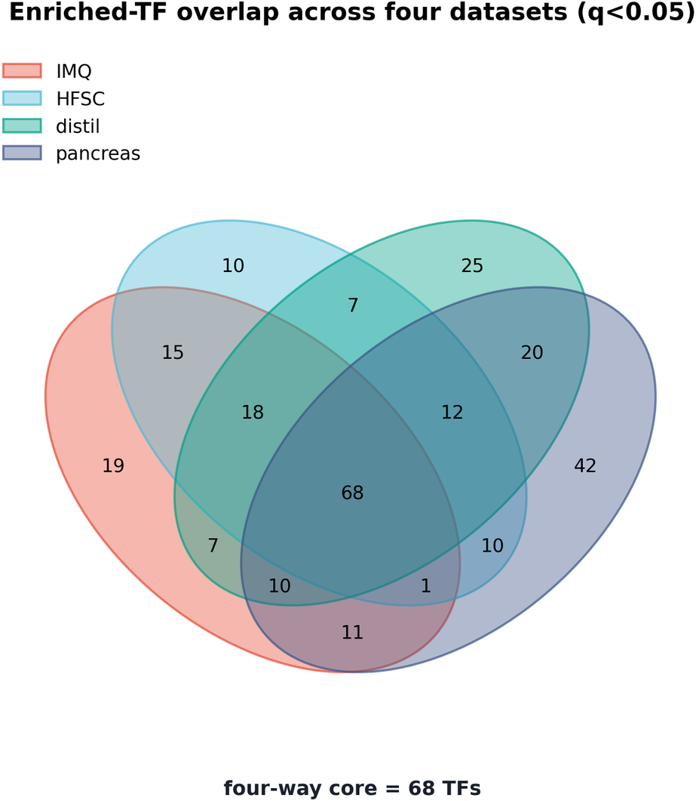
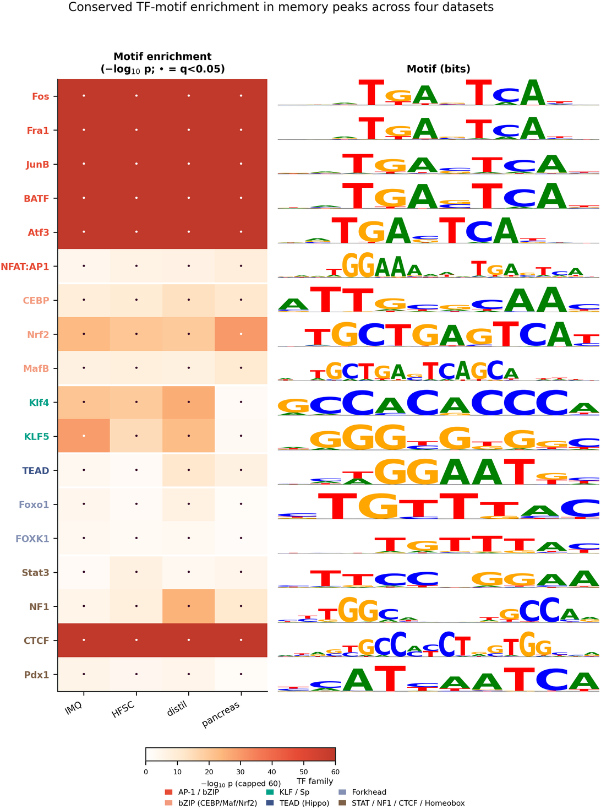
</p>

**Central claim:** injury/inflammation memory converges at the *trans*-regulatory level — a conserved **AP-1 / KLF / TEAD / CTCF** enhancer-memory program implemented through largely dataset-specific *cis*-elements and target genes.

## 7. From memory peaks to readable AP-1 enhancers (PAME)

Sequential filtering of the 2,325 epidermal memory peaks: **+ AP-1 motif** (656) → **+ AP-1 binding** (Set B, 467) → **+ H3K27ac active enhancer** (Set A / **PAME**, 209 regions, 202 genes). PAME regions are 45 % H3K27ac-active vs 5 % of background (8.9×, *p* ≈ 10⁻⁹⁴).

<p align="center">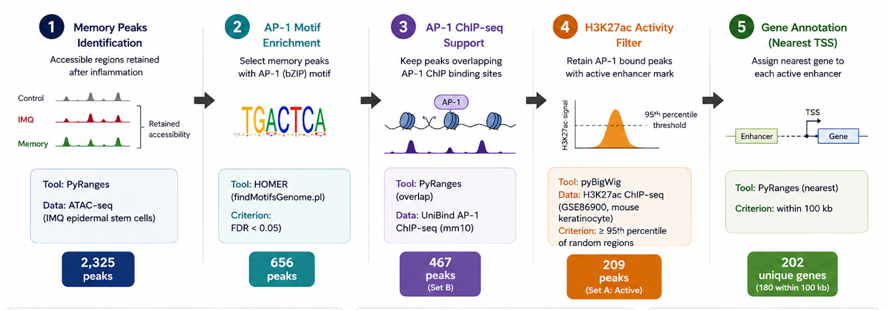</p>

## 8. PAME genes converge on adhesion, junctions and cytoskeleton

STRING shows a connected module enriched for **cell adhesion, junctions, ECM and the actin cytoskeleton** — the machinery of wound repair, and the same machinery dismantled during EMT/invasion. Most genes are independently linked to epithelial cancer.

<p align="center">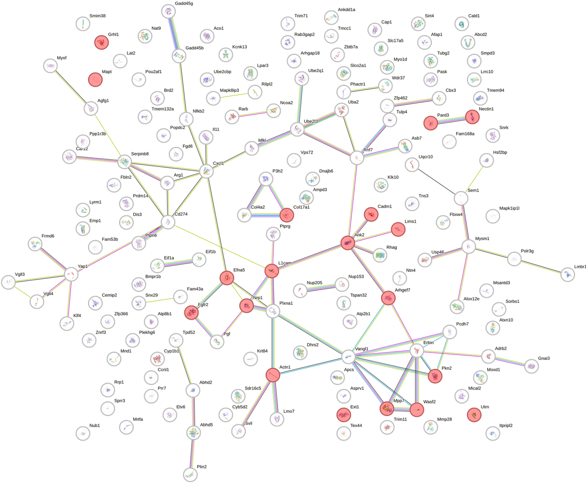</p>

| Gene | Function | Cancer / invasion link |
|---|---|---|
| *Col17a1* | Hemidesmosome collagen | EpdSC aging; cutaneous SCC marker |
| *Cadm1 / Nectin1 / Pard3* | Adhesion & polarity | Junctional/polarity tumour suppressors |
| *Wasf2* (WAVE2) | Actin nucleation | Invasive migration |
| *Mrtfa / Mical2* | Actin-responsive TF / redox | EMT & metastasis effectors |
| *Actn1 / Lims1* (PINCH) | Cytoskeleton / focal adhesion | Migration; carcinoma prognosis |
| *Cxcl1* | AP-1-driven chemokine | Pro-tumour signalling |

## 9. Aging: PAME enhancers resist the age-associated accessibility decline

Mapped onto an epidermal single-nucleus aging atlas (GSE288730): PAME rises with age while background falls (pseudobulk +0.091 vs −0.060, *p* = 5×10⁻⁴; rank AUC 0.598). Crucially, the gain is **established by adulthood and then saturates** (non-monotonic). *Rigour caveat:* at the correct animal level the increase is not significant (*p* = 0.15, Cohen's *d* = 0.07) — a directionally consistent trend, not a strong quantitative effect.

<p align="center">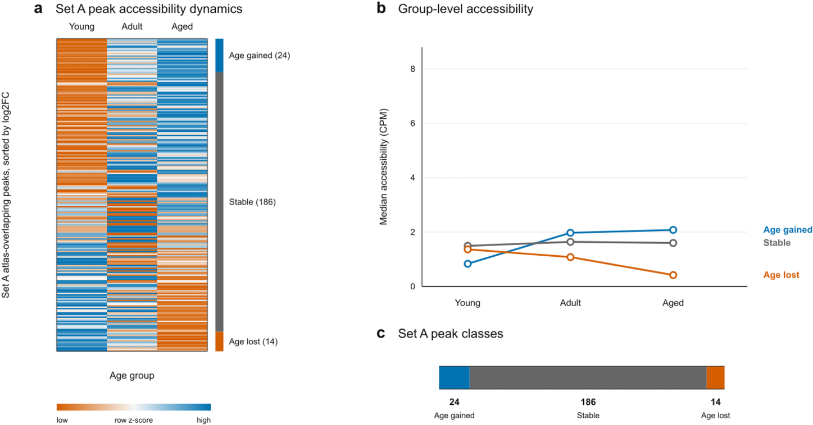</p>

## 10. Validation: AP-1 enrichment among age-DARs saturates in adulthood

Unbiased differentially-accessible regions confirm it: AP-1 is enriched among **young→adult** DARs but **not** aged→young — AP-1 opening happens by adulthood, then decays.

<p align="center">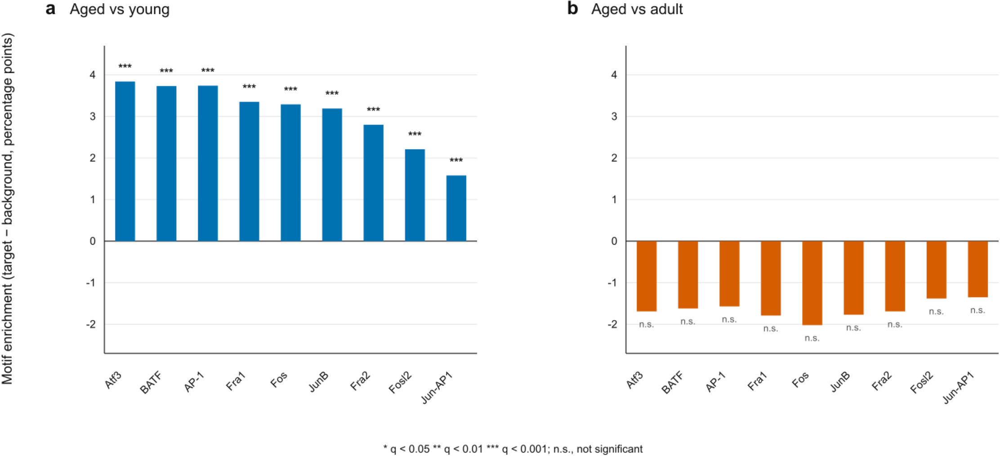</p>

## 11. Mouse → human: pre-cancer and squamous cell carcinoma

**116 of 209** PAME regions lifted uniquely to hg38; 202 mouse genes → **183 human orthologs**. Tested across normal → actinic keratosis → cSCC (GSE277274, a 2026 multi-omics study), AP-1-primed accessibility is already engaged in the **pre-cancer** state — the signature of epigenetic field cancerization.

<p align="center">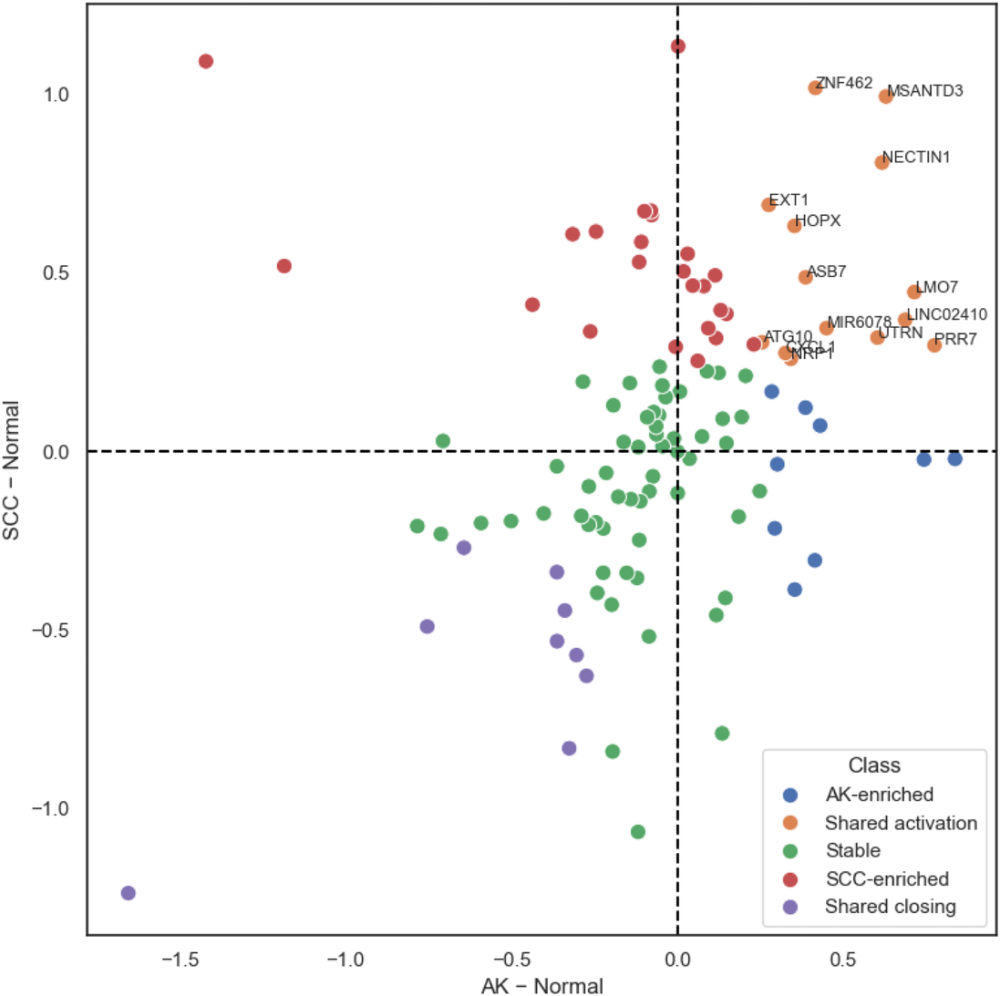</p>

## 12. TCGA-HNSC survival

In TCGA head-and-neck squamous carcinoma (477 patients, 220 deaths), the focused **14-gene AP-1 signature** predicts worse overall survival.

| Signature | Genes | HR (95% CI) | Cox *p* | Log-rank *p* |
|---|---:|---|---:|---:|
| 106-gene AP-1 | 106 | 1.31 (0.88–1.93) | 0.18 | 0.15 |
| **14-gene AP-1** | 14 | **1.50 (1.09–2.08)** | **0.014** | 0.058 |

14-gene set: `PRR7, LMO7, LINC02410, MSANTD3, NECTIN1, UTRN, MIR6078, ZNF462, ASB7, HOPX, NRP1, CXCL1, EXT1, ATG10`.

<p align="center">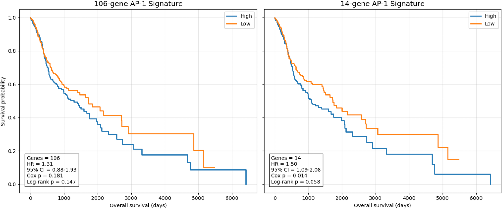</p>

---

## Repository layout

```
PeakMemory_repo/
├── README.md                      ← this landing page (full report + figures)
├── requirements.txt
├── docs/
│   ├── Methods_and_Results.md     ← the report (markdown)
│   ├── Methods_and_Results.docx   ← the report (Word)
│   ├── DATA.md                    ← data manifest: accessions + what is/ isn't committed
│   └── figures/                   ← all report figures
├── src/                           ← analysis code, by stage
│   ├── 01_memory_pipeline/  02_cross_dataset/  03_pame/
│   ├── 04_aging/  05_cancer_precancer/  06_tcga_survival/
│   └── figures/  homer/
├── gene_sets/                     ← all curated gene lists, signatures & region BEDs
│   ├── 01_memory_genes_per_dataset/  02_memory_genes_shared/
│   ├── 03_pame_core/  04_pame_pathways/
│   └── 05_aging_dynamics/  06_cancer_signature/
└── results/                       ← small final outputs + per-stage markdown reports
    ├── memory_peaks/  cross_dataset/  pame/  aging/  cancer/
```

## Gene sets

All curated gene lists, signatures and region files live in [`gene_sets/`](gene_sets/) (see its [README](gene_sets/README.md)):
the per-dataset and shared memory-gene lists, the PAME Set A/B lists and BEDs, the 202-gene mouse and 183-gene human signatures, GO/KEGG/Reactome tables, the aging age-gained/lost/stable sets, and the **14-gene TCGA prognostic signature**.

## Results

Per-stage markdown reports and small final outputs are in [`results/`](results/): memory-peak QC per dataset, cross-dataset peak/gene/TF overlap and permutation nulls, the PAME enrichment summary, the aging analysis, and the pre-cancer/cancer resume.

## Reproducing the analysis

Stages run in order; each consumes public data documented in [`docs/DATA.md`](docs/DATA.md).

```bash
pip install -r requirements.txt
# 1. Memory peaks (per dataset → four stringency variants)
python src/01_memory_pipeline/prepare_inputs.py
python src/01_memory_pipeline/memory_peak_pipeline.py --input-dir <inputs> --results-dir <out>
# 2. Cross-dataset convergence + permutation nulls
python src/02_cross_dataset/null_test.py
# 3. PAME (AP-1 motif → UniBind binding → H3K27ac)
python src/03_pame/ap1_primed.py
# 4. Aging (GSE288730)
python src/04_aging/subset_epdsc.py && python src/04_aging/analyze_epdsc_aging.py
# 5. Cancer: liftOver + GSE277274; TCGA-HNSC survival notebook
jupyter notebook src/06_tcga_survival/tcga_hnsc_survival.ipynb
```

> **Note.** Several scripts use absolute session paths and a local HOMER/genome install; set the paths at the top of each script before re-running. `memory_peak_pipeline.py` is fully CLI-driven and path-independent.

## Data availability

This is a meta-analysis of public data; large inputs are **not committed** (see [`.gitignore`](.gitignore) and [`docs/DATA.md`](docs/DATA.md)). Accessions: IMQ (Larsen 2021 / Naik 2017), HFSC **GSE165312**, distil **GSE221408**, pancreas (Del Poggetto 2021), H3K27ac **GSE86900**, aging atlas **GSE288730**, pre-cancer/cSCC **GSE277274**, and **TCGA-HNSC** (GDC).

## References

Naik *et al.* Nature 2017 · Larsen *et al.* Cell Stem Cell 2021 · Gonzales *et al.* Science 2021 · Levra Levron *et al.* Nat Cell Biol 2023 · Del Poggetto *et al.* Science 2021 · Netea *et al.* Science 2016 · Martínez-Zamudio *et al.* Nat Cell Biol 2020 · Eckert *et al.* J Skin Cancer 2013 · Curtius *et al.* Nat Rev Cancer 2018 · TCGA Network, Nature 2015. Full list in [`docs/Methods_and_Results.md`](docs/Methods_and_Results.md).
